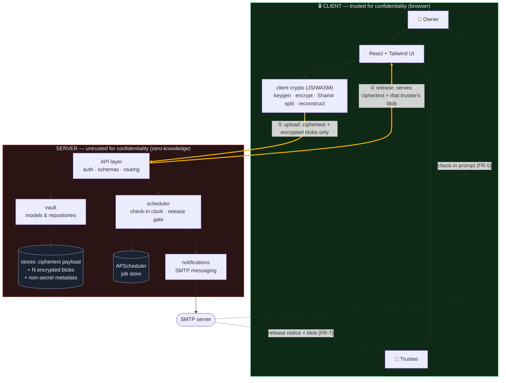

# High-level architecture

How the pieces fit under the [zero-knowledge trust model](../srs/index.md#23-trust-model).
The decisive structural fact: **all payload cryptography lives on the client.**
The server orchestrates scheduling and stores only ciphertext, `N` trustee-
encrypted share blobs, and metadata — it can never decrypt (`NFR-SEC-5`).

**Reading the boundary.** The two thick amber edges are the *only* data flows
that cross the client/server trust boundary, and both carry **ciphertext only**:

- **① Upload** — the Owner's browser encrypts the payload and splits the key,
  then uploads ciphertext + `N` trustee-encrypted blobs (`FR-2`, `FR-2a`).
- **② Release** — after the gate opens, the server serves the ciphertext and
  each trustee their own encrypted blob; decryption and `K`-of-`N`
  reconstruction happen back inside the client boundary (`FR-8`).

Nothing that crosses into the server is ever plaintext: no payload, no key, no
plaintext share (`NFR-SEC-5`).

## Component responsibilities

| Component | Responsibility | Location |
| --- | --- | --- |
| Client crypto (JS/WASM) | Key generation, payload encryption, Shamir split **and** reconstruction — the **deployed** crypto | **client** (browser) |
| crypto (Python) | **Authoritative** SSS spec + test oracle; emits the shared test vectors the JS must reproduce | `code/crypto` (dev/test) |
| Web UI | Owner/trustee interactions, responsive web only (NG-2) | client |
| API layer | Transport, auth, validation, orchestration — no payload crypto | `code/api` (server) |
| scheduler | Deadlines, lifecycle transitions, the never-early release gate | `code/scheduler` (server) |
| vault | Domain models & repositories; stores ciphertext + blobs + metadata | `code/vault` (server) |
| notifications | Check-in prompts and encrypted-blob delivery over SMTP | `code/notifications` (server) |

> **Crypto: two implementations, one spec.** The deployed cryptography is the
> client crypto (JS/WASM) above. The Python `code/crypto` package is the
> **authoritative specification and test oracle** — fully unit/property-tested
> (`NFR-MAINT-1`) — that emits versioned test vectors the JS must reproduce
> exactly. Neither is a throwaway reference to the other.

## Trust and data-flow notes

- Only ciphertext and trustee-encrypted blobs cross into the server; the DB
  stores ciphertext + blobs + non-secret metadata (`NFR-SEC-1`, `NFR-SEC-5`).
- The plaintext key exists only transiently in **client** memory — the Owner's
  browser at encryption, a trustee's browser at reconstruction — never on the
  server.
- `scheduler` owns every path toward release and is backed by a persistent job
  store so deadlines survive restarts (`NFR-REL-2`).
- Honest limit: the server delivers the client code, so a malicious server is
  out of scope of the zero-knowledge guarantee — see threat
  [`T-4`](../threat-model.md).

## Design patterns

| Pattern | Where | Why |
| --- | --- | --- |
| **Strategy** | notification channels (`notifications`) | The delivery mechanism sits behind an abstract notifier, so a channel can be swapped/added without touching the scheduler or API (keeps NG-1 "email only" a one-seam decision). |
| **Observer / event** | scheduler state transitions (`scheduler`) | Lifecycle transitions emit events that observers (notifications, audit log) react to, decoupling *what changed* from *who cares* about it. |
| **Repository** | data access (`vault`) | All persistence is mediated by repositories, so SQLite↔PostgreSQL is invisible to the rest of the system — this is what makes `NFR-PORT-1` achievable. |
| **State** | vault lifecycle (`scheduler`/`vault`) | Each state (Active/Warning/Grace/Released) governs which transitions and actions are legal, making the never-early-release gate (`NFR-REL-1`) a structural property rather than scattered conditionals. |

← Back to the [SRS](../srs/index.md) · [threat model](../threat-model.md) · see
also the [use-case diagram](use-case.md) and
[vault lifecycle](vault-lifecycle.md).
