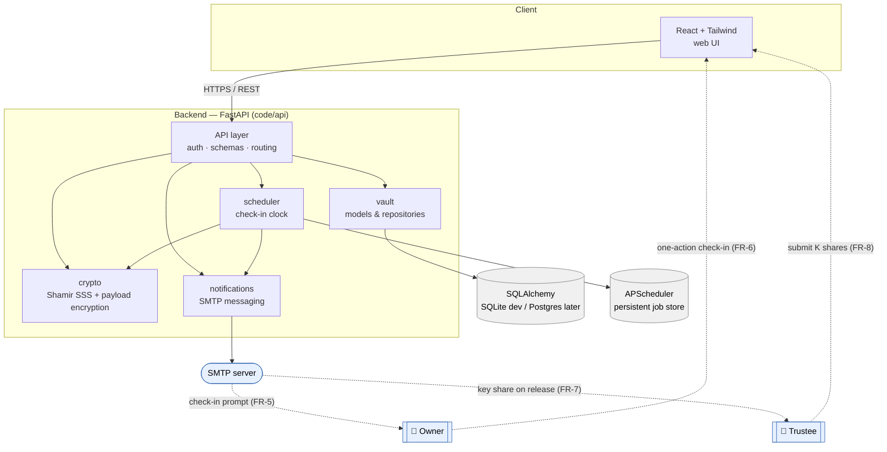

# High-level architecture

How the pieces fit. The React frontend talks to a FastAPI backend, which
delegates to four domain packages; persistence, scheduling, and email are the
external-facing edges.

## Component responsibilities

| Component | Responsibility | Package |
| --- | --- | --- |
| Web UI | Owner/trustee interactions, responsive web only (NG-2) | *(frontend)* |
| API layer | Transport, auth, validation, orchestration | `code/api` |
| crypto | Shamir split/reconstruct + payload encryption | `code/crypto` |
| scheduler | Deadlines, lifecycle transitions, release gate | `code/scheduler` |
| vault | Domain models & repositories | `code/vault` |
| notifications | Check-in prompts and share delivery over SMTP | `code/notifications` |

## Trust and data-flow notes

- The payload crosses the API only as ciphertext once sealed; the database
  stores ciphertext + metadata only (`NFR-SEC-1`).
- The plaintext key exists transiently in `crypto` during split (setup) and
  reconstruction (post-release) — never persisted.
- `scheduler` owns every path toward release and is backed by a persistent job
  store so deadlines survive restarts (`NFR-REL-2`).

← Back to the [SRS](../srs/index.md) · see also the
[use-case diagram](use-case.md) and [vault lifecycle](vault-lifecycle.md).
