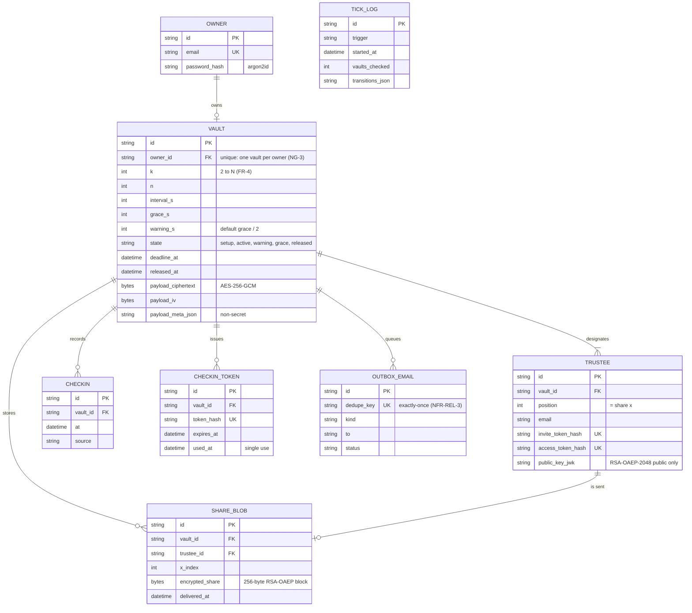

# Data model

The SQLAlchemy model in `code/vault/models.py` (SQLite locally, Postgres on
Neon in deployment; `NFR-PORT-1`). Payload and shares exist only as ciphertext
and encrypted blobs; tokens are stored only as SHA-256 hashes; timestamps are UTC.

← Back to [Diagrams](index.md) · [sequences](sequences.md)
