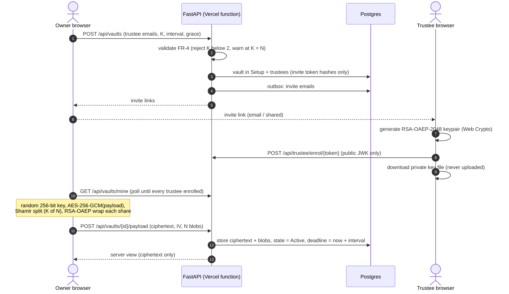
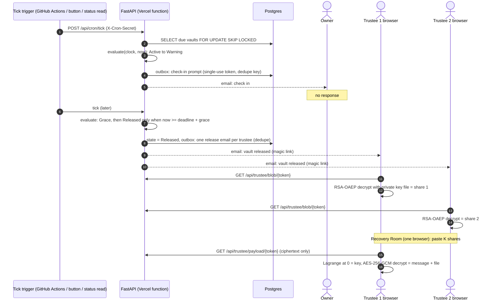

# Sequence diagrams

How the prototype carries out the two flows that matter, end to end. Everything
inside a browser box happens on the client; only ciphertext and encrypted blobs
ever reach the server (`NFR-SEC-5`).

## Create and seal a vault (FR-1 … FR-4, FR-2a)

## Release and recover (FR-5 … FR-8)

← Back to [Diagrams](index.md) · [architecture](architecture.md) · [data model](data-model.md)
