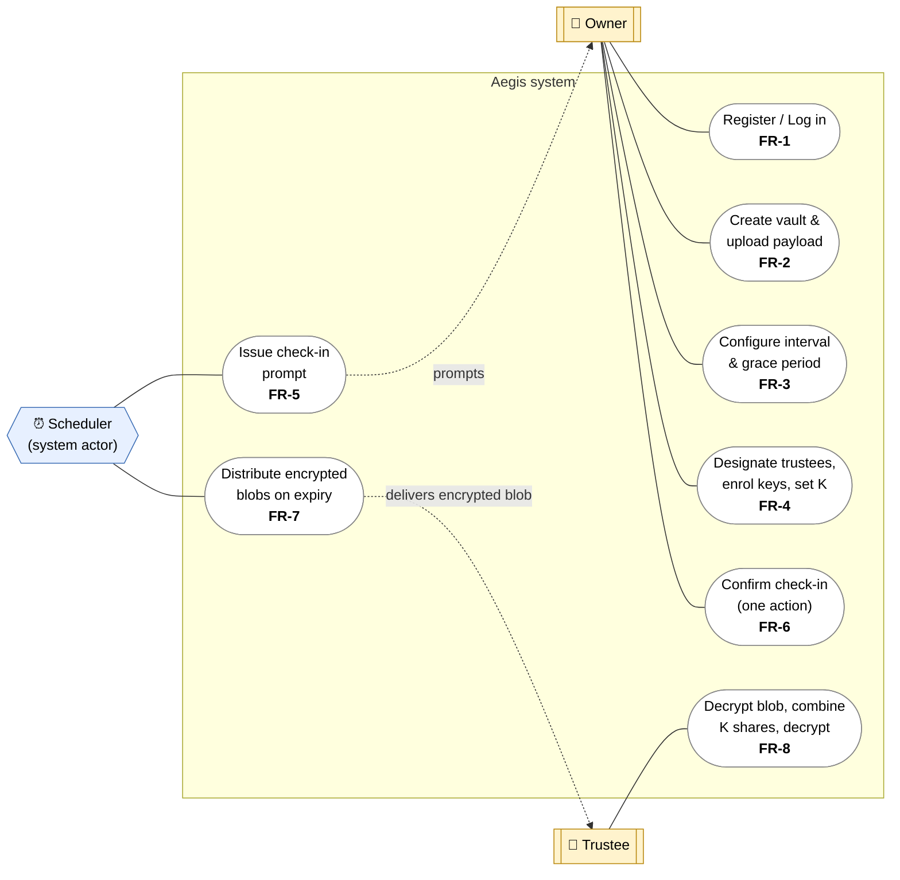

# Use-case diagram

Actors and the use cases they participate in. The **Scheduler** is modelled as a
*system actor*: it is time-triggered and initiates prompts and release with no
human action. Each use case is annotated with the functional requirement it
realises (see the [SRS](../srs/index.md#5-functional-requirements)).

## Notes

- **Owner** drives set-up (`FR-1`–`FR-4`) and keeps the vault closed by
  confirming check-ins (`FR-6`).
- **Scheduler** is the only actor that can move the vault toward release: it
  prompts (`FR-5`) and, *only* after the deadline and grace period lapse,
  distributes each trustee's **encrypted blob** (`FR-7`). This gate is the
  subject of `NFR-REL-1` (no early release).
- **Trustee** acts only after release, **decrypting their blob** and then
  combining `K` shares to reconstruct the key and decrypt the payload
  client-side (`FR-8`).

← Back to the [SRS](../srs/index.md) · see also the
[vault lifecycle](vault-lifecycle.md) and [architecture](architecture.md).
