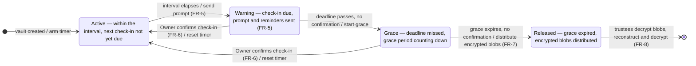

# Vault lifecycle — state diagram

The core time-driven behaviour of a vault. Transitions are labelled
`trigger / action` and the release path is gated so a vault can **never** open
early (`NFR-REL-1`).

## Transition table

| From | To | Trigger | Guard / action |
| --- | --- | --- | --- |
| *(start)* | Active | Vault created | Arm the check-in timer. |
| Active | Warning | Check-in interval elapses | Send check-in prompt (`FR-5`). |
| Warning | Active | Owner confirms check-in | One-action confirm (`FR-6`); reset timer. |
| Warning | Grace | Check-in deadline passes, still unconfirmed | Begin the grace-period countdown. |
| Grace | Active | Owner confirms check-in | One-action confirm (`FR-6`); reset timer. |
| Grace | Released | Grace period expires, still unconfirmed | Distribute one encrypted blob per trustee (`FR-7`). |
| Released | *(end)* | Trustees decrypt blobs, combine `K` shares | Reconstruct key, decrypt payload — all client-side (`FR-8`). |

## The safety gate

The only edge into **Released** is `Grace → Released`, and it fires **exclusively**
when *both* the check-in deadline and the full grace period have elapsed with no
confirmation. Any confirmation from **Warning** or **Grace** returns the vault to
**Active**. This is the structural expression of `NFR-REL-1` (never release
early) and `NFR-REL-3` (release exactly once).

← Back to the [SRS](../srs/index.md) · see also the
[use-case diagram](use-case.md) and [architecture](architecture.md).
